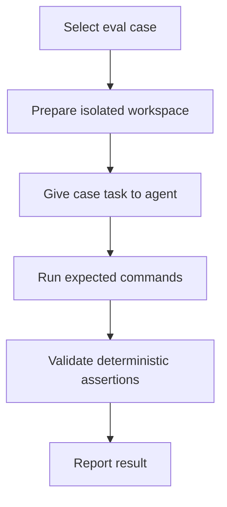

# Agent Evals

Agent evals — это repository-local smoke scenarios для качества процесса работы agent. Product tests проверяют behavior
Copia; эти evals поддерживают небольшой набор checks для scope control, architecture discipline, regression-test
discipline и resistance к test suppression.

## Компоненты evals

`cases/`

- Основные components: один Markdown file на eval case с front matter fields `id`, `title`, `task`, `fixture`,
  `allowed_scope`, `forbidden_changes`, `expected_commands`, `deterministic_assertions` и `hard_failure_conditions`.
- Причина изменения: добавляй новый case, когда recurring agent failure mode требует coverage, или обновляй existing
  case, когда изменились repository policy, module boundaries, required commands или acceptance expectations.

`run-evals.sh`

- Основные components: deterministic catalog validator для структуры eval cases. Он проверяет required fields, unique case
  IDs, current-repository fixtures, supported expected commands, executable repository scripts и known deterministic
  assertion identifiers.
- Причина изменения: обновляй runner при изменении case schema, добавлении нового deterministic assertion identifier или
  необходимости ужесточить validation.

## Формат case

Каждый case — Markdown file с YAML-like front matter. Required fields:

- `id`
- `title`
- `task`
- `fixture`
- `allowed_scope`
- `forbidden_changes`
- `expected_commands`
- `deterministic_assertions`
- `hard_failure_conditions`

Поддерживаемые deterministic assertion identifiers определены в `run-evals.sh`.

## Запуск

Проверь eval catalog:

```bash
./harness/evals/run-evals.sh
```

Runner не выполняет Codex end to end. Он проверяет внутреннюю согласованность minimal eval catalog.

## Процесс evals



1. Select eval case: выбери case, соответствующий проверяемому process behavior, например scope control, test
   discipline или architecture compliance.
2. Prepare isolated workspace при manual run case: используй temporary worktree, disposable branch или copy, чтобы eval
   не повредил main workspace.
3. Give case task to agent: передай agent case task и referenced fixture, сохраняя repository policies и active task
   rules как нормативные instructions.
4. Run expected commands: выполни commands, перечисленные case, например `./harness/scripts/test.sh`,
   `./harness/scripts/check.sh` или `./harness/evals/run-evals.sh`.
5. Validate deterministic assertions: проверь наличие required objective evidence, например unchanged forbidden paths,
   command evidence, regression-test rationale или отсутствие generated file edits.
6. Report outcome, command evidence, assumptions и unresolved risks в review или completion report.

## Deterministic и manual части

Deterministic validation покрывает catalog structure, required file presence, supported expected commands, duplicate IDs,
known assertion identifiers и fixture values.

Manual review покрывает reasoning quality, sufficiency of tests, scope judgment, architecture judgment beyond static checks
и reporting quality.
