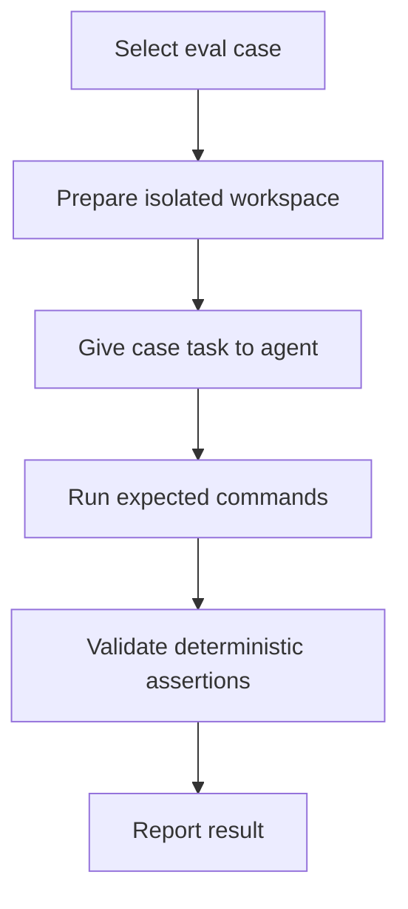

# Agent Evals

Agent evals are repository-local smoke scenarios for agent process quality. Product tests verify Copia behavior; these evals keep a small set of checks for scope control, architecture discipline, regression-test discipline, and test-suppression resistance.

## Evals Component

`cases/`

- Main components: one Markdown file per eval case, with front matter fields for `id`, `title`, `task`, `fixture`, `allowed_scope`, `forbidden_changes`, `expected_commands`, `deterministic_assertions`, and `hard_failure_conditions`.
- Reason to change: add a new case when a recurring agent failure mode needs coverage, or update an existing case when repository policy, module boundaries, required commands, or acceptance expectations change.

`run-evals.sh`

- Main components: deterministic catalog validator for eval case structure. It checks required fields, unique case IDs, current-repository fixtures, supported expected commands, executable repository scripts, and known deterministic assertion identifiers.
- Reason to change: update the runner when the case schema changes, a new deterministic assertion identifier is introduced, or validation needs to become stricter.

## Case Format

Each case is a Markdown file with YAML-like front matter. Required fields are:

- `id`
- `title`
- `task`
- `fixture`
- `allowed_scope`
- `forbidden_changes`
- `expected_commands`
- `deterministic_assertions`
- `hard_failure_conditions`

Supported deterministic assertion identifiers are defined in `run-evals.sh`.

## Running

Validate the eval catalog:

```bash
./harness/evals/run-evals.sh
```

The runner does not execute Codex end to end. It validates that the minimal eval catalog is internally consistent.

## Evals Process



1. Select eval case: choose the case that matches the process behavior being tested, such as scope control, test discipline, or architecture compliance.
2. Prepare isolated workspace when manually running a case: use a temporary worktree, disposable branch, or copy so the eval cannot damage the main workspace.
3. Give case task to agent: provide the case task and any referenced fixture while keeping repository policies and active task rules as the normative instructions.
4. Run expected commands: execute the commands listed by the case, such as `./harness/scripts/test.sh`, `./harness/scripts/check.sh`, or `./harness/evals/run-evals.sh`.
5. Validate deterministic assertions: inspect whether required objective evidence exists, such as unchanged forbidden paths, command evidence, regression-test rationale, or no generated file edits.
6. Report the outcome, command evidence, assumptions, and unresolved risks in the review or completion report.

## Deterministic And Manual Parts

Deterministic validation covers catalog structure, required file presence, supported expected commands, duplicate IDs, known assertion identifiers, and fixture values.

Manual review covers reasoning quality, sufficiency of tests, scope judgment, architecture judgment beyond static checks, and reporting quality.
